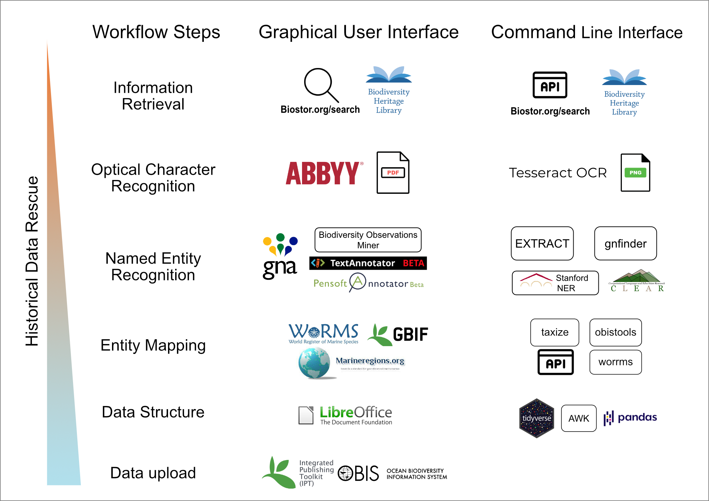

# Workflow for legacy literature annotation EMODnet

Legacy literature contains valuable information about biodiversity. Dedicated workflows are needed in order to extract this information and transform it in structured data format. This is process is a multiple step process requiring many tools and interdisciplinary knowledge. In 2015, a [workshop](httpse//riojournal.com/articles.php?journal_name=rio&id=10445) was help in [IMBBC - HCMR](https://imbbc.hcmr.gr) to standardize this process within the framework of [EMODnet biology](https://www.emodnet-biology.eu).

A new, upgraded report (part of EMODnet Phase III, available [here](https://www.emodnet-biology.eu/sites/emodnet-biology.eu/files/public/documents/EMODnet_Biology_III/Deliverables/D3.7.pdf)) was released on 07/12/2020 that focuses on the comparison of different tools and interfaces in order to automate and assist the curation process. Specifically, tools in terms of OCR and text mining technologies were tested and reviewed with the aim to design a workflow that can accommodate the need for automation and acceleration in digitizing historical datasets and extracting their information. Two types of curation workflows were described as shown in Figure 1; one that relies on web applications and the other that combines programming libraries and packages. The latter is scalable, customisable and replicable but requires programming skills whereas the former is easy to implement through Graphical User Interfaces (GUI) at the expense of the previous advantages.

This repository is supplementary to this report for the programming / Command Line Interface workflow. It aims to provide the basis for it's implementation accompanied with an example.


**Figure 1.** The proposed workflows with the available tools. On the left, the GUI web applications are displayed and on the right the programming libraries and command line tools. This repository contains the scripts to use the CLI and programming tools for this workflow.

## Repository structure

* `scripts/` contains the scripts with the code that we used in this workflow
* `example-legacy-literature/` contains the example of the original PDF file and the OCR text.
* `NER/` contains the output of the NER tools
* `gui-tools-screenshoots/` some screenshoots of the tools that are used in the report and are mentioned in **Figure 1**

## Prerequisites

All the following code was tested on a mac with 8gb RAM and Intel(R) Core(TM) i5-4258U CPU @ 2.40GHz running macOS Catalina 10.15.7.

### System Tools

* GNU bash, version: 3.2.57
* R version: 4.0.3
* perl version: 5.32.0

### Data transformation tools

* awk version: 20070501
* ghostscript version: 9.53.3
* ImageMagick version: 7.0.10-30
* jq version: 1.6
* tidyverse R package suite version: 1.3.0

### Workflow Tools

* Tesseract OCR version: 4.1.1
* gnfinder version: v0.11.1
* EXTRACT version: 2
* taxize R package version: 0.9.99

## PDF text extraction

### OCR-ready PDF

Scanning expedition reports, research articles and books has been well underway. [Biodiversity Heritage Library](https://www.biodiversitylibrary.org) contains many such publications which in some cases have been OCRed using the [ABBYY FineReader tool](https://about.biodiversitylibrary.org/ufaqs/what-is-optical-character-recognition-ocr-and-how-does-bhl-use-it/). When that is case of a PDF file it is possible to extract the text directly. The command-line tool that has this functionality is `ghostscript` and the basic command is `gs`.

```
gs -sDEVICE=txtwrite -o output.txt legacy-literature.pdf
```
With the above command the text from the legacy-literature.pdf file is extracted and saved into output.txt making ready for following tools.

### Scanned PDF without OCR

In cases that the PDF file is a collection of scanned images it is necessary to perform OCR. In this workflow we choose the tesseract OCR engine which is open source and active in development. Tesseract doesn't handle PDF files so we have to transform the PDF into multiple PNG files. To do this we use the ImageMagick tool and the command `convert`.

```
convert -density 400 legacy-literature.pdf -quality 100 legacy-literature.png
```

The option `density` refers to the pixels of the image and `quality 100` is set to make sure that 100% of the quality is maintained upon transformation. 


```
for f in *.png; do tesseract -l eng $f ${f%".png"}; done
```

Then we can combine all the pages into one txt document

```
cat *.txt >> legacy-literature.txt
```

Complex documents with figures and tables can be *OCRed* with [PyTesseract](https://fazlurnu.com/2020/06/23/text-extraction-from-a-table-image-using-pytesseract-and-opencv/)

## Named Entity Recognition - NER

### EXTRACT species and environments and tissues

We used the [EXTRACT tool](https://extract.jensenlab.org/) to detect entities of species, environments and tissues for text. EXTRACT uses the API of the [JensenLab tagger](https://github.com/larsjuhljensen/tagger) through the perl script downloaded here `scripts/getEntities_EXTRACT_api.pl`.

To run the script:

```
./getEntities_EXTRACT_api.pl legacy-literature.txt > legacy-literature-extract.tsv
```

EXTRACT returns a tsv file with 3 columns (tagged_text, entity_type, term_id). 

* tagged_text is the snippet of the matched text

* entity_type is the refers to the category of the entity : species = -2, environments = -27, tissues = -25. There are others (e.g PubChem Compound identifiers = -1) but are not used in biodiversity data.

* term_id is the respective id of the entity. For species EXTRACT uses NCBI ids, for environments Environment Ontology terms and for tissues BRENDA Tissue Ontology terms


We can later transform them to names by :

1. download the ttps://ftp.ncbi.nlm.nih.gov/pub/taxonomy/taxdump.tar.gz

```
wget https://ftp.ncbi.nlm.nih.gov/pub/taxonomy/taxdump.tar.gz
```
2. use the node.dmp (we need the tax id and rank id columns) and names.dmp (we need the tax id and names in text)
3. change the delimiter from \t|\t to \t

```
more nodes.dmp | sed 's/:ctrl-v-tab:\|//g' > nodes_tab.tsv

more names.dmp | sed 's/:ctrl-v-tab:\|//g' > names_tab.tsv
```
4. merge the node.dmp and names.dmp based on the first column

```
awk -F'\t' 'FNR==NR{a[$1]=$3;next} ($1 in a) {print $1,a[$1],$2}' nodes_tab.tsv names_tab.tsv > ncbi_nodes_names.tsv
```
5. Remove the NCBI prefix of EXTRACT 
6. Merge the files

### gnfinder

[`gnfinder`](https://github.com/gnames/gnfinder) is a command line tool that finds scientific names from text using dictionary and nlp approaches. It serves as the engine of the online tool [Global Names Recognition and Discovery](http://gnrd.globalnames.org/)and is also used in many other platforms like [Biodiversity Heritage Library](https://about.biodiversitylibrary.org/ufaqs/taxonomic-data-sources-for-names/) among others.


```
gnfinder find legacy-literature.txt > legacy-literature-gnfinder.json
```

`gnfinder` returns a json file that has 2 arrays, metadata and names.

To extract the names

```
more legacy-literature-gnfinder.json | jq '.names[] | {name: .name} | [.name] | @tsv' | sed 's/"//g' > legacy-literature-gnfinder-species.tsv
```

## Entity mapping


## Tool performance evaluation

