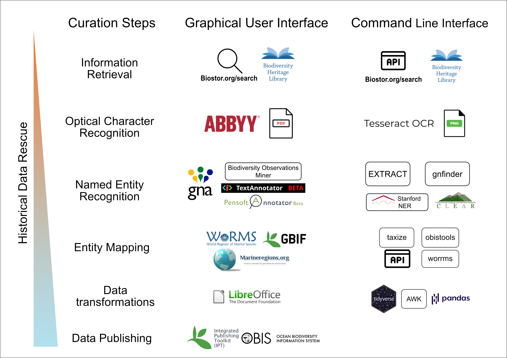

# DECO  - bioDivErsity data Curation wOrkflow

[](https://github.com/lab42open-team/deco/releases)
[](https://github.com/lab42open-team/deco/blob/master/LICENSE)
[](https://singularity-hub.org/collections/5193)

## Programming Workflow for biodiversity legacy literature annotation

* [Introduction](#introduction)
* [Purpose](#purpose)
* [Structure](#repository-structure)
* [Testing](#testing)
* [Prerequisites](#prerequisites)
* [Environment](#environment)
* [Instructions](#running-instructions)
* [PDF text extraction](#pdf-text-extraction)
* [Named Entity Recognition](#named-entity-recognition---ner)
* [Entity mapping](#entity-mapping)
* [Feedback](#feedback)
* [Future improvements](#future-improvements)
* [Citation](#citation)
* [Licence](#licence)

## Introduction

Legacy literature contains valuable information about biodiversity. Dedicated workflows are needed in order to extract this information and transform it in structured data format. This is process is a multiple step process requiring many tools and interdisciplinary knowledge. In 2015, a [workshop](httpse//riojournal.com/articles.php?journal_name=rio&id=10445) was help in [IMBBC - HCMR](https://imbbc.hcmr.gr) to standardize this process within the framework of [EMODnet biology](https://www.emodnet-biology.eu).

A new, upgraded report (part of EMODnet Phase III, available [here](https://www.emodnet-biology.eu/sites/emodnet-biology.eu/files/public/documents/EMODnet_Biology_III/Deliverables/D3.7.pdf)) was released on 07/12/2020 that focuses on the comparison of different tools and interfaces in order to automate and assist the curation process. Specifically, tools in terms of OCR and text mining technologies were tested and reviewed with the aim to design a workflow that can accommodate the need for automation and acceleration in digitizing historical datasets and extracting their information. Two types of curation processes were described as shown in Figure 1; one that relies on web applications and the other that combines programming libraries and packages. The latter is scalable, customisable and replicable but requires programming skills whereas the former is easy to implement through Graphical User Interfaces (GUI) at the expense of the previous advantages.

This repository is supplementary to this report for the programming / Command Line Interface workflow. It aims to provide the basis for it's implementation accompanied with an example.


**Figure 1.** The proposed workflows with the available tools. On the left, the GUI web applications are displayed and on the right the programming libraries and command line tools. This repository contains the scripts to use the CLI and programming tools for this workflow. 

## Purpose

DECO workflow is a demonstration of our vision, and not a complete pipeline tool, for biodiversity data rescue using programming tools. It brings together state of the art image processing and OCR tools with text mining technologies and Web APIs in order to assist curators. Furthermore, by using programming interface and Command Line Tools this workflow is scalable and customisable.


**Figure 2** DECO workflow takes a PDF file as input and generates tables with information for taxa and generates a report for a more comprehensive summary of the results.

## Repository structure

* `scripts/` contains the scripts with the code that we used in this workflow
* `example-legacy-literature/` contains the example of the original PDF file and the ipt file from the results of the manual curation.
* `output` contains the output of the workflow tools
* `gui-tools-screenshoots/` some screenshoots of the tools that are used in the report and are mentioned in **Figure 1**

## Testing

The workflow was tested on these machines/platforms:

* macbook pro with 8gb RAM and Intel(R) Core(TM) i5-4258U CPU @ 2.40GHz running macOS Catalina 10.15.7.
* Hewlett-Packard Compaq Presario laptop with 4gb RAM and Intel(R) Pentium(R) Dual-Core CPU T4200 @ 2.00GHz running Linux Ubuntu 18.04.5 LTS (Bionic Beaver)

| *OS* | *CPU* | *RAM* | *Running time (source)* | *Running time (container)* |
| :----:       |    :----:   |    :----:   |    :----:   |    :----:   |
| macOS Catalina 10.15.7 | Intel(R) Core(TM) i5-4258U CPU @ 2.40GHz | 8gb | 28 minutes | 33 minutes (Docker) |
| Linux Ubuntu 18.04.5 LTS (Bionic Beaver) | Intel(R) Pentium(R) Dual-Core CPU T4200 @ 2.00GHz | 4gb | 20 minutes | 27 minutes (Docker)|
| Linux Debian server 4.9.0-8-amd64 | Intel(R) Xeon(R) Silver 4114 CPU @ 2.20GHz | 64gb | NA | 20 minutes (Singularity) |

The workflow takes ~30 minutes to execute the provided example. The first 6 minutes are pdf convertion to images and OCR; both of these steps are the most cpu hungry steps of the workflow but even a 12 year old machine performed very well.  The remaining time are the API calls from EXTRACT and Worms API both of which have system sleep enabled not to overload the servers.

In terms of storage, the pdf convertion step, creates tmp files that in the case of a big pdf (>50 pages) multiple gigabytes are reserved.

### Large scale test

We applied DECO the [The marine Bivalvia (Mollusca) of Greece](http://www.marinespecies.org/imis.php?module=ref&refid=206202), a 320 pages scanned document, on the Linux Debian server described above through singularity. The OCR step took 33 minutes to complete and used all the ram memory available ~60gb. The following steps lasted for 3h and 12minutes reaching a total of 3h and 45 minutes elapsed time.

## Prerequisites

### System Tools

* GNU bash, version: 3.2.57
* R version: 4.0.3
* perl version: 5.32.0

### Data transformation tools

* awk version: 20070501
* ghostscript version: 9.53.3
* ImageMagick version: 7.0.10-30
* jq version: 1.6
* tidyverse R package suite version: 1.3.0
* httr R package version: 1.4.2

### Workflow Tools

* Tesseract OCR version: 4.1.1
* gnfinder version: v0.11.1
* EXTRACT version: 2

## Environment

### Conda

Conda environment is the suggested method to run DECO. Using miniconda as the base
is the preferred base.

```
conda env create --file environment.yml --name deco
conda activate deco
conda env update --file environment.yml
```

With the above 3 line you first create the conda enviroment, then activate it
and finally install all dependences.


This workflow is also provided as a Docker and Singularity container for simplisity of execution. The Docker container is 4.58gb in size.

### Docker image

To run the Docker container locally you must have Docker installed. In linux systems the `sudo` command before `docker` is mandatory.

To download the image:

```
docker pull savvasparagkamian/deco
```

Running the workflow:

```
docker run -it savvasparagkamian/deco
```
From inside the container run

```
./scripts/cli-workflow.sh -f example-legacy-literature/reportofbritisha1843-appendix-1.pdf -d output
```
### Singularity container

The workflow is also available as a Singularity container which is suitable for large scale applications of the workflow. 

Download the image:

```
singularity pull shub://savvas-paragkamian/deco:latest
```
Then `bind` a local directory with the files you want to process and open the shell of singularity

```
singularity shell --bind user/path/to/directory/:/home/deco/output deco_latest.sif
```
and from `Singularity deco_latest.sif:~>` run
```
cd /home/deco/
```
From the shell you can follow the instructions below to perform the analysis.

```
Singularity deco_latest.sif:/home/deco> ./scripts/cli-workflow.sh -f output/legacy_publication.pdf -d output/
```

## Running instructions

This workflow uses APIs in NER and Entity Mapping so be sure to have a stable internet connection. To run this workflow execute the following command:

```
./scripts/cli-workflow.sh -f example-legacy-literature/reportofbritisha1843-appendix-1.pdf -d output
```
There are two options required, -f that specifies the location of the pdf file within the repo and -d that specifies the new folder name that all the outputs will be saved. On each run an id is created that is written on the filename of all generated files. The generated files are: 

* `png` files for each page of the pdf file
* `txt` files for each page of the pdf file
* `extract.tsv` file with the NER results of the EXTRACT API
* `json` file from the gnfinder tool
* `gnfinder.tsv` file transformed from the previous json file
* `extract_organisms_worms.tsv` Aphia Ids and their data
* `gnfinder-species_worms.tsv` Aphia Ids and their data

!!! Carefull in case you choose a big pdf file (>50 pages). See [below](#caution-for-large-pdf-files) before running!!!

## PDF text extraction

### OCR-ready PDF

Scanning expedition reports, research articles and books has been well underway. [Biodiversity Heritage Library](https://www.biodiversitylibrary.org) contains many such publications which in some cases have been OCRed using the [ABBYY FineReader tool](https://about.biodiversitylibrary.org/ufaqs/what-is-optical-character-recognition-ocr-and-how-does-bhl-use-it/). When that is case of a PDF file it is possible to extract the text directly. The command-line tool that has this functionality is `ghostscript` and the basic command is `gs`.

```
gs -sDEVICE=txtwrite -o output.txt legacy-literature.pdf
```
With the above command the text from the legacy-literature.pdf file is extracted and saved into output.txt making ready for following tools.

### Scanned PDF without OCR

In cases that the PDF file is a collection of scanned images it is necessary to perform OCR. In this workflow we choose the tesseract OCR engine which is open source and active in development. Tesseract doesn't handle PDF files so we have to transform the PDF into multiple PNG files. To do this we use the ImageMagick tool and the command `convert`.

```
convert -density 400 legacy-literature.pdf -quality 100 legacy-literature.png
```

The option `density` refers to the pixels of the image and `quality 100` is set to make sure that 100% of the quality is maintained upon transformation. 

#### Caution for large pdf files

if the pdf file has more than 50 pages ImageMagick creates huge tmp files. If you handle these files see [these instructions](https://imagemagick.org/script/command-line-options.php#limit) to limit available resourses.


After the png convertion we run tesseract for each of these images.

```
for f in *.png; do tesseract -l eng $f ${f%".png"}; done
```

Then we can combine all the pages into one txt document

```
cat *.txt >> legacy-literature.txt
```

Complex documents with figures and tables can be *OCRed* with [PyTesseract](https://fazlurnu.com/2020/06/23/text-extraction-from-a-table-image-using-pytesseract-and-opencv/)

## Named Entity Recognition - NER

### EXTRACT species and environments and tissues

We used the [EXTRACT tool](https://extract.jensenlab.org/) to detect entities of species, environments and tissues for text. EXTRACT uses the API of the [JensenLab tagger](https://github.com/larsjuhljensen/tagger) through the perl script downloaded here `scripts/getEntities_EXTRACT_api.pl`.

To run the script:

```
./getEntities_EXTRACT_api.pl legacy-literature.txt > legacy-literature-extract.tsv
```

EXTRACT returns a tsv file with 3 columns (tagged_text, entity_type, term_id). 

* tagged_text is the snippet of the matched text

* entity_type is the refers to the category of the entity : species = -2, environments = -27, tissues = -25. There are others (e.g PubChem Compound identifiers = -1) but are not used in biodiversity data.

* term_id is the respective id of the entity. For species EXTRACT uses NCBI ids, for environments Environment Ontology terms and for tissues BRENDA Tissue Ontology terms


### gnfinder for organisms names

[`gnfinder`](https://github.com/gnames/gnfinder) is a command line tool that finds scientific names from text using dictionary and nlp approaches. It serves as the engine of the online tool [Global Names Recognition and Discovery](http://gnrd.globalnames.org/)and is also used in many other platforms like [Biodiversity Heritage Library](https://about.biodiversitylibrary.org/ufaqs/taxonomic-data-sources-for-names/) among others.


```
gnfinder find legacy-literature.txt > legacy-literature-gnfinder.json
```

`gnfinder` returns a json file that has 2 arrays, metadata and names.

To extract the names

```
more legacy-literature-gnfinder.json | jq '.names[] | {name: .name} | [.name] | @tsv' | sed 's/"//g' > legacy-literature-gnfinder-species.tsv
```

## Entity mapping

The goal in this workflow is to reach to Aphia Ids for organisms mentioned in historical data. The `gnfinder` and `EXTRACT` tools return scientific names and NCBI ids, respectively.

For organism names the GET request URL is `https://www.marinespecies.org/rest/AphiaRecordsByName/Nebalia?like=true&marine_only=false&offset=1` for the genus Nebalia.

For NCBI ids the GET request URL is `https://www.marinespecies.org/rest/AphiaRecordByExternalID/7568?type=ncbi` for NCBI:7568.

## Reporting

An automated report is generated with DECO that visually presents the results of the previous steps. The report is an html file exported from a Rmarkdown script.

## Tool performance evaluation

Using standard methodology for evaluation the results from each tool can be classified with the following conditions by comparing them withe manual curated spreadsheet.

| Condition positive | Condition negative |
| :----:       |    :----:   |
| True Positive (TP) | False positive (FP) |
| False negative (FN) | True negative (TN) |

## Feedback

We are happy to receive any feedback from users regarding questions, issues and most importanly contributions. If you have any questions please about the workflow please use the [Discussions section](https://github.com/lab42open-team/deco/discussions).

In case you find any bugs, performance issues or request a new feature from the workflow please submit to [Github Issues](https://github.com/lab42open-team/deco/issues).

Last but not least, we warmly welcome contributions. Follow the instructions from [Contributing](https://github.com/lab42open-team/deco/blob/master/CONTRIBUTING.md) document to submit through [Pull requests](https://github.com/lab42open-team/deco/pulls) your fixes and improvements to the workflow.

## Future improvements

* The locality of samplings is equally important in ecology. One of the first tools that extracted locality information from text is [EnvMine](https://bmcbioinformatics.biomedcentral.com/articles/10.1186/1471-2105-11-294#Sec12) in 2010 which unfortunaly is deprecated. A generic python tool, [mordecai](https://github.com/openeventdata/mordecai), combines the [spacy](https://spacy.io) NLP engine with [keras](https://keras.io) deep learning library both trained from [GeoNames](http://www.geonames.org) gazetteer data. This when implemented with [marineregions](https://www.marineregions.org/gazetteer.php?p=webservices&type=rest#!/getGazetteerRecordsByName/Array) API will be state of the art. 
* incorporate geolocation mining technologies in the workflow like [`CLEAR Earth`](https://github.com/ClearEarthProject/ClearEarthNLP)
* use the locality results from ClearEarth and/or Standford NER tools to get Gazetteer Records from [MarineRegions.org API](https://www.marineregions.org/gazetteer.php?p=webservices&type=rest#!/getGazetteerRecordsByName/Array)
* process at the paragraph level to retrieve co-occurrencies of organisms and environments
* further optimize the output in [Darwin Core format](https://dwc.tdwg.org)

## Citation

Georgia Sarafidou (HCMR), Savvas Paragkamian (HCMR), Vasilis Gerovasileiou (HCMR), Evangelos Pafilis (HCMR), Dimitra Mavraki (HCMR), Christina Pavloudi (HCMR), Christos Arvanitidis (HCMR / LifeWatch ERIC), Joana Beja (VLIZ), Menashè Eliezer (OGS), Marina Lipizer (OGS), Laura Boicenco (NIMRD). Scientific document on the design of the workflow of text mining technologies in data archaeology. EMODnet - WP3- Data archaeology. 07/12/2020.

## Licence

This workflow is under the GNU GPLv3 license (for 3rd party components separate licenses apply).

```
    Copyright (C) 2021 Savvas Paragkamian

    This program is free software: you can redistribute it and/or modify
    it under the terms of the GNU General Public License as published by
    the Free Software Foundation, either version 3 of the License, or
    (at your option) any later version.

    This program is distributed in the hope that it will be useful,
    but WITHOUT ANY WARRANTY; without even the implied warranty of
    MERCHANTABILITY or FITNESS FOR A PARTICULAR PURPOSE.  See the
    GNU General Public License for more details.

    You should have received a copy of the GNU General Public License
    along with this program.  If not, [see](http://www.gnu.org/licenses).
```

### Licences of dependencies

* ghostscript 9.53.3 - [GNU Affero General Public License (AGPL)](https://www.gnu.org/licenses/agpl-3.0.html)
* jq 1.6 - [MIT license](https://github.com/stedolan/jq/blob/master/COPYING)
* ImageMagick 7.0.10-30 - [Copyright 1999-2021 ImageMagick Studio LLC](https://imagemagick.org/script/license.php), a non-profit organization dedicated to making software imaging solutions freely available.
* tesseract 4.1.1 - [Apache License 2.0](https://github.com/tesseract-ocr/tesseract/blob/master/LICENSE)
* gnfinder v0.11.1 - [MIT License](https://github.com/gnames/gnfinder/blob/master/LICENSE)
* EXTRACT v2 - [BSD 2-Clause License](https://extract.jensenlab.org)


